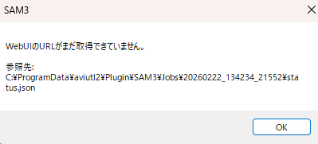
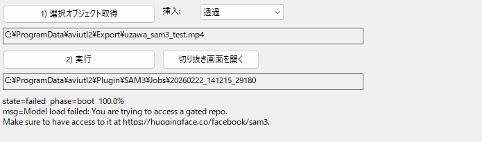
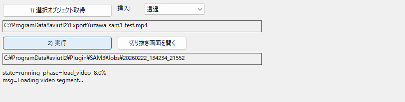
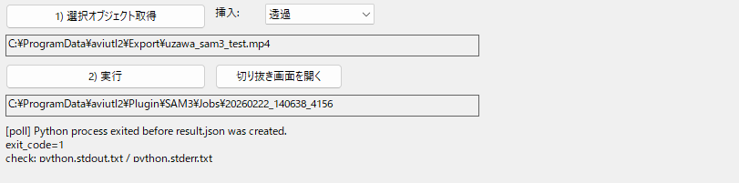

<p align="center">
  <a href="https://www.nicovideo.jp/watch/sm45931905" target="_blank" rel="noopener noreferrer">
    
  </a>
  <a href="https://www.nicovideo.jp/watch/sm45931905" target="_blank" rel="noopener noreferrer">
  
  </a>
</p>

# はじめに
[](https://github.com/clean262/sam3_bb_gb_generator)
[](https://github.com/clean262/sam3_bb_gb_generator/releases/latest)
[](https://github.com/clean262/sam3_bb_gb_generator/blob/main/LICENSE)
[](https://github.com/clean262/sam3_bb_gb_generator/commits/main)

クリックで簡単に動画を切り取れるAviutl2プラグインです。

- **マウスクリック**だけで前景・背景を指定
- 切り抜いた前景のみ(背景のみ)を**Aviutl2に自動挿入**
- 挿入方法は**BB/GB/透過と選択可能**
- プレビューしながら前景・背景を調整
- 複数フレームに対してクリック可能
- point/Box形式で前景・背景を指定可能
- テキストで前景を指定可能(実装中)

**紹介動画**は[こちら](https://www.nicovideo.jp/watch/sm45931905)から<br>
<a href="https://www.nicovideo.jp/watch/sm45931905">
  
</a>

# 利用に際して
本プラグインを用いて動画制作を行った場合[親作品登録](https://www.nicovideo.jp/watch/sm45931905)をしていただけると開発の励みになります。<br>
親作品登録いただいたら見に行きます。

開発状況等は作者[X: 旧twitter](https://x.com/clean123525)を参照してください。

バグ報告や機能追加の要望、利用に際して分からない点がありましたらまず本ページ下部にある Q&A セクションをご覧ください。<br>
その上で分からないことがあればｍ[Issues](https://github.com/clean262/sam3_bb_gb_generator/issues)から気軽にお願いします。<br>
右上`New issue`ボタンから送れます。

また本プラグインはコミュニティの発展のために、Aviutl2本体の[親作品登録](https://commons.nicovideo.jp/works/nc422952)を推奨しています。<br>
[Aviutl2-catalog](https://github.com/Neosku/aviutl2-catalog)を利用することでAviutl2本体/プラグイン/スクリプトの親作品リストを一括で取得できます。<br>
<a href="https://commons.nicovideo.jp/works/nc422952">
  
</a>

# 関連プラグイン/ソフト
### 1. Aviutl2 かんたん物体切り抜きプラグイン<br>
<!-- [Github](https://github.com/clean262/sam_frame_export_filter) [解説動画](https://www.nicovideo.jp/watch/sm45723074)<br> -->
[](https://github.com/clean262/sam_frame_export_filter)
[](https://www.nicovideo.jp/watch/sm45723074) <br> 
本プラグインの静止画切り抜き版です。<br>
本プラグインと比較して軽量のため、スペックが低いパソコンでも動かすことが出来ます。<br>
<a href="https://www.nicovideo.jp/watch/sm45723074">
  
</a>

### 2. 静止画背景を自動で切り抜こう - さぶんぬっころ
[](https://x.com/was9th/status/1993200961456886129)
[](https://www.nicovideo.jp/watch/sm45665649) <br>
Aviutl2プラグインではありませんが、背景素材のみのシーンが存在する場合において前景を綺麗に切り取ることが出来ます。<br>
<a href="https://www.nicovideo.jp/watch/sm45665649">
  
</a>

### 3. AIを使って簡単にBB素材を作ろう！
[](https://colab.research.google.com/drive/14cdEQP3l5t0Ma5OyxptBnNCokOi6LBIw?usp=sharing)
[](https://www.nicovideo.jp/watch/sm44970717) <br>
本プラグインが採用しているSAM3の1世代前のモデルであるSAM2で切り抜きが行えます。<br>
Aviutl2プラグインではありませんが、Google Colabで実行できるため導入不要で切り抜きが行えます。<br>
<a href="https://www.nicovideo.jp/watch/sm44970717">
  
</a>

### 4. Aviutl2 Remove Background
[](https://github.com/arajun94/AviUtl2_Remove_Background)<br>
本プラグインのSAM2版です。
性能は低下しますが、複数のモデルを選択できます。

# 実行確認環境
- Aviutl2 beta32以上(**必須**)
- Windows11
- NVIDIA Geforece RTX 3060

# 導入方法
## Nvidia driver install
NVIDIAのGPUを搭載したパソコンを所有している方は実行してください。搭載していない方は飛ばしてください。<br>
GPUを用いてかなり高速な動画切り取りを行うことが出来ます。<br>
この[ページ](https://www.kkaneko.jp/tools/win/nvidiadriver.html)に従ってインストールしてください。<br>

```bash
nvidia-smi
```
上記コマンドをターミナル等のアプリで入力した際に、CUDA Version: 12.8 以上の表記が出ていればOKです。<br>
**既にNvidia driverをインストールされている方でもCUDA Version: 12.8 以上の表記が出るかは確認してください**

## gitのインストール
ターミナル等のアプリで以下のコマンドを入力し、gitがインストール済みと確認できる方は飛ばしてください
```bash
git --version
```
エラーが出る方は元々インストールされてませんので、この[ページ](https://prog-8.com/docs/git-env-win)に従ってgitをインストールしてください。<br>
サイト内での`2. Gitの初期設定`まで実行していただければOKです。

## SAM3の利用登録
[Hugging Face](https://huggingface.co/join)にアクセスし、アカウントを作成してください。<br>


[facebook/sam3](https://huggingface.co/facebook/sam3)にアクセスし、以下の項目を入力してください。<br>
許可が下りるまでしばらく時間がかかります（~~数十分から数時間~~）<br>
<span style="color:red;">※場合によっては2〜3週間待つ可能性があります。</span>それ以上待つ場合はSAM3側へ問い合わせしてみて下さい<br>


access tokenを[発行](https://huggingface.co/settings/tokens)し
右上のCreate new tokenから、新しいtokenを作成してください。<br>
ここで発行したtokenは一度しか表示されないので、保存し忘れた場合新たなtokenを作成してください。<br>
これはHugging Faceのトークンのため、SAM3の申請の有無にかかわらず発行することが出来ます。<br>


すぐ下に記載のある[プラグインのインストール](##プラグインのインストール)からプラグインをインストール後(catalogからでもReleaseからでもどちらからでも大丈夫です)。<br>
取得したトークンをターミナル等のアプリで、以下のコマンドを**1行ずつ**入力してください。<br>
トークンを入力するタイミングは`Enter your token(input will not be visible):`の時です。<br>
トークンはパスワードと同様、他人に見せてはならないものなので、入力しても何も表示されませんが入力されています。<br>
Add token as git credential?にはnでOKです。<br>
```bash
cd C:\ProgramData\aviutl2\Plugin\SAM3\python
.\uv.exe run hf auth login
```
トークンを登録できたかを確認するには以下のコマンドを1行ずつ入力してください。
```bash
cd C:\ProgramData\aviutl2\Plugin\SAM3\python
.\uv.exe run python -c "from huggingface_hub import whoami; print(whoami())"
```
`{'type': 'user', 'id':`...の後が自分が作成したhugging faceのアカウント名と一致し、最後の部分`'auth': {'type': 'access_token', 'accessToken': {'displayName':...`以降が自分の作成したトークンの名前、そして`role`が正しく`READ`になっていることを確認してください。<br>

SAM3の利用申請は、SAM3側が手動で許諾をとっているようです。<br>
[こちら](https://huggingface.co/settings/gated-repos)でSAM3がAcceptedになっていれば承認されています。Pendingの場合、まだ保留中です。しばらくお待ちください。

## プラグインのインストール
Nvidia driverのインストール、gitのインストールとSAM3の利用登録を終えたら、プラグインのインストールには2種類のインストール方法があります。

### Aviutl2-catalogからインストールする場合(**推奨**)
[Aviutl2-catalog](https://github.com/Neosku/aviutl2-catalog)をダウンロードし、インストールボタンを押すだけで導入は完了です。

> **Aviutl2-catalog** は、AviUtl2 のプラグインやスクリプトを「検索→導入→更新」まで一括管理できるデスクトップアプリです。<br>
> 従来のようにダウンロード時には解凍してファイルを移動させる必要はありません。また、アップデートがあれば通知が来て1クリックで更新も完了します。<br>
> 利用したプラグイン/スクリプトの親作品リストも一括で取得できます。

<a href="https://commons.nicovideo.jp/works/nc422952">
  
</a>

### Releaseからインストールする場合(optional)
catalogを利用していない人はこちらの方法でインストールしてください。
[Github Release](https://github.com/clean262/sam3_bb_gb_generator/releases)から最新の`SAM3_win64.zip`をダウンロードして下さい。<br>
zipを解凍後、`install.cmd`をダブルクリックしてください。セキュリティの警告に対して実行を押していただくと、インストールが完了します。


# 使い方
Aviutl2起動後、左上 `表示` の欄から `SAM3` を選択してください。<br>


下のような画面が表示されるので、タイムライン上で切り抜きたい動画を選択し、挿入形式を決定してください。<br>


実行ボタンを押し、Gradio is runningの表示が出たら切り抜き画面を開くを押してください。<br>


切り抜き用の画面が開かれます。<br>


画面をクリックすると選択範囲が示されます。<br>
間違えた場合は右のReset Promptボタンを押してください。<br>
Frameのバーを動かすと、複数フレームで選択したい領域を指定できます。<br>
また、`point label`を`negative`にすると選択したくない領域を指摘できます <br>


Prompt typeをBoxに指定し、左上の点と右下の点を指定すると長方形で範囲を指定できます。<br>
Boxで指定した後、クリックで追加指定することも可能です。(逆は出来ません)


Object IDを指定することで、複数の物体を指定することも可能です。<br>


指定したら`Propagate across segments`ボタンを押してください。切り抜きが行われます。<br>
切り抜き精度に不満がある場合はFrameのバーを動かし、再度クリックやBoxで領域指定してから`Propagate across segments`ボタンを押すことも可能です。<br>


`Render Preview`ボタンを押すと切り抜き結果を確認できます。<br>


最後に、`Finish`を押すとAviutl2に切り抜き結果が自動挿入されます。<br>


# Q&A
## カタログのダウンロード時に、5/5でエラーが出現する
gitのインストールが出来ていないです
この[ページ](https://prog-8.com/docs/git-env-win)に従ってgitをインストールしてください。<br>
サイト内での`2. Gitの初期設定`まで実行していただければOKです。

また、v0.0.5までにおいて、pythonとtorchのバージョン不整合によりダウンロード時にエラーが発生しておりました。<br>
旧バージョンをご利用の方は最新バージョンにアップデートしてください。

## web UIのURLが取得できない
 <br>
これは何らかの理由で, 切り抜き用の画面が開けないことを意味しています。<br>
ここだけでは原因が分からないので、透過/BB/Gbを選択したSAM3 ウィンドウの一番下の箇所を参照してください。<br>
**以下にメッセージごとの対処法を記載します。**

## Model load failed:エラー
発行したトークン周りで何かしらのエラーが生じています。<span style="color:red;">※(画像のエラーメッセージは1例です。類似のメッセージが出る場合もあります)</span>　<br>
 <br>
様々な可能性が考えられますので、まず順番に以下の内容を確認してください

1. SAM3がAcceptedされているか  
   [こちら](https://huggingface.co/settings/gated-repos)でSAM3が`Accepted`になっているかを確認してください。<br> 
   `pending`の場合は承認されるまで待ってください。<br> 

2. 発行したトークンが`READ`権限を持つか  
   [こちら](https://huggingface.co/settings/tokens)で発行したトークンのPermissionが`Fine-grained`ではなく`READ`になっているかを確認してください。<br> 
   `Fine-Grained`になっている場合、新たに`READ`で作り直してください。<br>
   `Fine-Grained`になっておりトークンを作り直す場合は以下のコマンドを1行ずつ入力しログアウトした後、再度導入方法に従ってトークンを登録してください。<br>
   ```powershell
   cd C:\ProgramData\aviutl2\Plugin\SAM3\python
   .\uv.exe run hf auth logout
   ```

3. 正しくトークンが登録できているか  
   以下のコマンドを1行ずつ入力してください。
    ```powershell
    cd C:\ProgramData\aviutl2\Plugin\SAM3\python
    .\uv.exe run python -c "from huggingface_hub import whoami; print(whoami())"
    ```
   2つ目のコマンドを入力した後の出力において、`{'type': 'user', 'id':`...の後が自分が作成したhugging faceのアカウント名と一致し、  
   最後の部分`'auth': {'type': 'access_token', 'accessToken': {'displayName':...`以降が自分の作成したトークンの名前、  
   そして`role`が正しく`READ`になっていることを確認してください。<br>
   正しくない場合は2. と同様にログアウトし、再度導入方法に従ってトークンを登録してください。

4. 以前にHugging faceを利用されたことがある方に起きうるエラー<br>

   環境変数に既に別のトークンが入っており、そのトークンにアクセス権限がないケースが考えられます。(環境変数に入っているトークンが今回設定したトークンより優先される)<br>
   `[Environment]::GetEnvironmentVariable("HF_TOKEN", "User")`のコマンドの出力がある方が該当します。<br>

   出力があった場合の解決策は環境変数を削除するないし、上書きするです。<br>
   (双方とも以前作成していたであろうトークンは削除することになるので、以前用いていたHugging faceを用いたコードが動かなくなる可能性はあります。<br>
   これを回避するには適切な権限を与えてあげてください。)<br>

   削除する場合は以下のコマンドを入力してください<br>
   `[Environment]::SetEnvironmentVariable("HF_TOKEN", $null, "User")`<br>

   上書きする場合は以下のコマンドを入力してください。`YOUR_TOKEN_HERE`の部分に作成したトークンを入力してください<br>
   `[Environment]::SetEnvironmentVariable("HF_TOKEN", "YOUR_TOKEN_HERE", "User")`<br>

### このエラーの原因を確認する方法<br>
`C:\ProgramData\aviutl2\Plugin\SAM3\Jobs`
に日付時刻が記されたフォルダがあり、該当するフォルダを開いて下さい。<br>
`python.log.txt`にエラーの原因が記載されています。<br>
AIに質問 / [Issues](https://github.com/clean262/sam3_bb_gb_generator/issues)で質問する際もこれをもとに質問してください

## Loading video segment...から全然進まない
初回利用時には3.5GBもの切り抜き用のSAM3モデルをダウンロードしています。時間がかかるのでそのまま待ってください<br>


## python process exited before result.json was createdエラー
 <br>

このエラーが出るときは、カタログでのダウンロード時に自動で実行されるライブラリのインストールが正しく出来ていないことが多いです。<br>
一度カタログから本プラグインをアンインストールし、インストールしなおして下さい。

まだ同様のエラーが起こる場合は、手動でライブラリをインストールすることが出来ます。<br>
C:\ProgramData\aviutl2\Plugin\SAM3\pythonにある、.venvフォルダをまとめて削除し、以下のコマンドを1行ずつ入力してください。
```bash
cd C:\ProgramData\aviutl2\Plugin\SAM3\Python
.\uv.exe sync --locked
```

### このエラーの原因を確認する方法<br>
`C:\ProgramData\aviutl2\Plugin\SAM3\Jobs`
に日付時刻が記されたフォルダがあり、該当するフォルダを開いて下さい。<br>
`python.stderr.txt`にエラーの原因が記載されています。<br>
AIに質問 / [Issues](https://github.com/clean262/sam3_bb_gb_generator/issues)で質問する際もこれをもとに質問してください

## init_video_session failed: DefaultCPUAllocator: not enough memoryエラー
一度に切り抜こうとする動画の秒数が長いとこのエラーが生じます。(各パソコンのメモリに依存)<br>
動画の長さを短くしてください。<br>

### このエラーの原因を確認する方法<br>
`C:\ProgramData\aviutl2\Plugin\SAM3\Jobs`
に日付時刻が記されたフォルダがあり、該当するフォルダを開いて下さい。<br>
`python.log.txt`にエラーの原因が記載されています。<br>
AIに質問 / [Issues](https://github.com/clean262/sam3_bb_gb_generator/issues)で質問する際もこれをもとに質問してください

## 切り抜き用の画面においてクリック時にエラー
v0.0.6において、Geforce RTX5000番台のGPUを利用されていた方に発生していたエラーです。<br>
カタログにおいてアップデートしてください。

### このエラーの原因を確認する方法<br>
`C:\ProgramData\aviutl2\Plugin\SAM3\Jobs`
に日付時刻が記されたフォルダがあり、該当するフォルダを開いて下さい。<br>
`python.log.txt`にエラーの原因が記載されています。<br>
AIに質問 / [Issues](https://github.com/clean262/sam3_bb_gb_generator/issues)で質問する際もこれをもとに質問してください

## 切り抜き時にパソコンが重い
切り抜く動画の長さが長くなると重くなるので適宜長さを調整してください。<br>

## Aviutl2起動時にSAM3 ウィンドウが自動表示される
今後直します

# ライセンス

**MIT ライセンス** 

<!-- # uv install
```bash
powershell -ExecutionPolicy ByPass -c "irm https://astral.sh/uv/install.ps1 | iex"
uv --version  # powershell再起動後表示が出ればOK
``` -->

<!-- # file install
```bash
git clone 
uv sync
uv run hf auth login # access tokenを発行(https://huggingface.co/settings/tokens)し入力(絶対公開しないでください) Add token as git credential?にはnでOK
uv run python -c "from huggingface_hub import whoami; print(whoami())" # access_tokenが出るならOK
uv run python -c "import torch; print('cuda:', torch.cuda.is_available())" # cuda: TrueならOK
uv run python app.py
``` -->